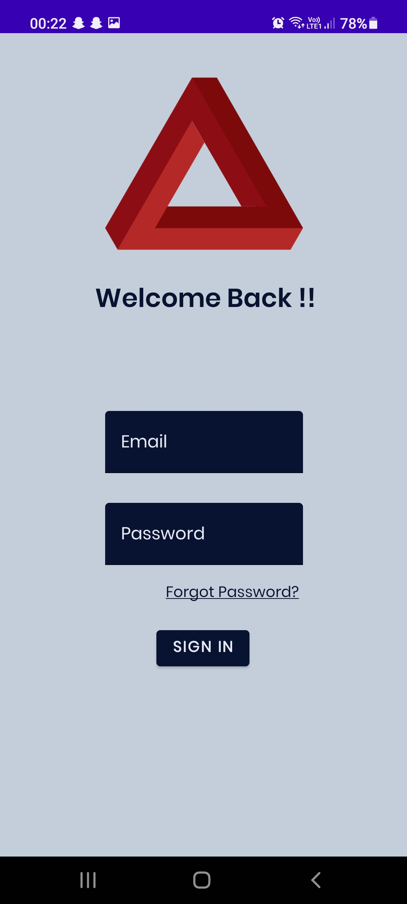
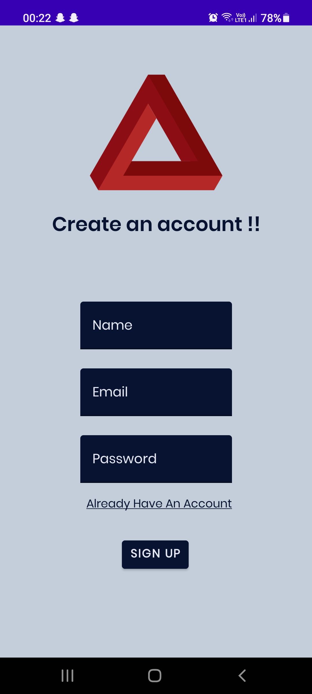
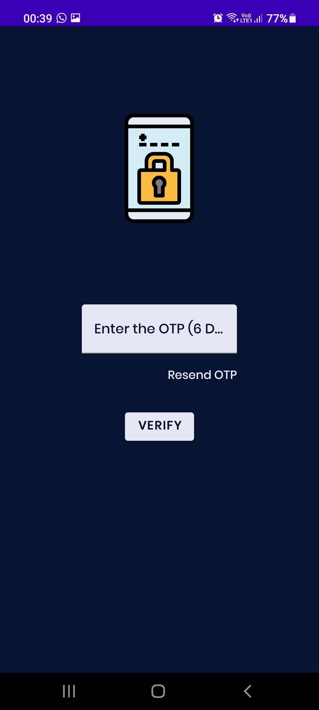
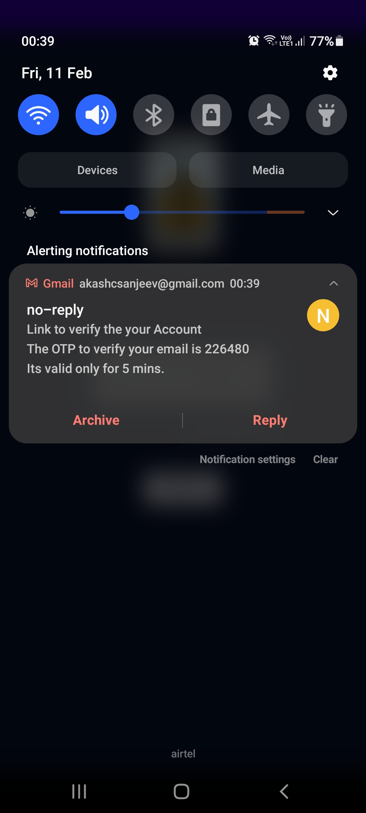
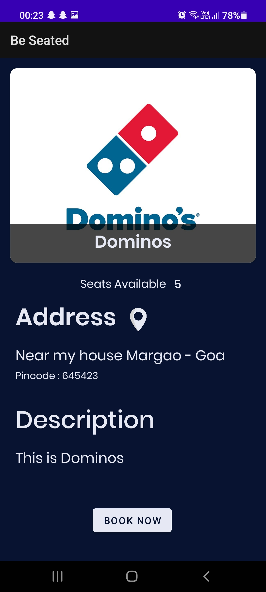
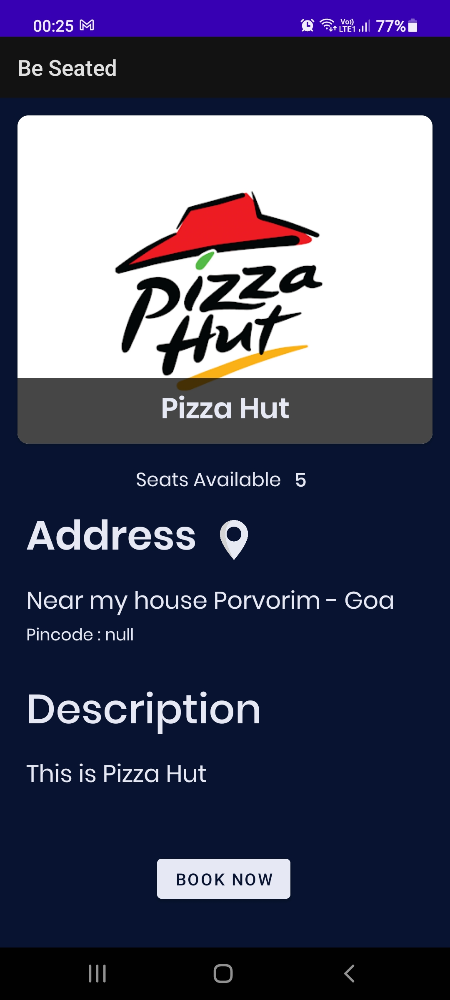
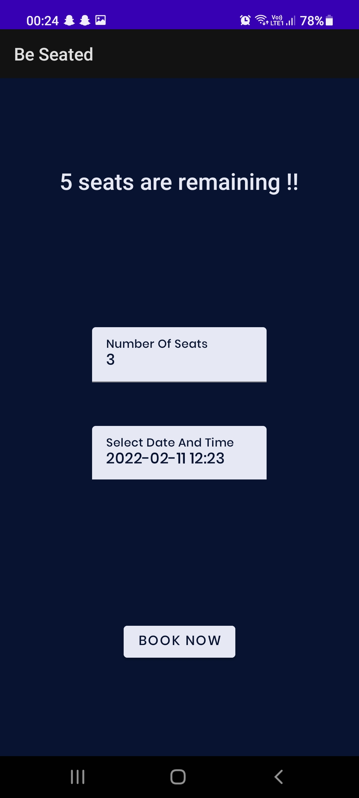
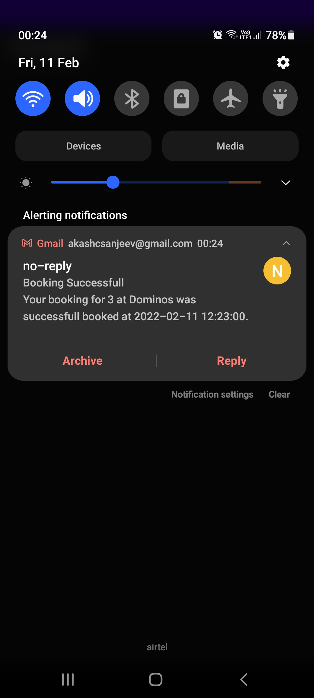
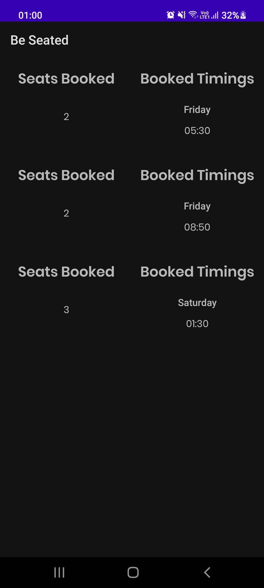

# Be-Seated

### App that let's you book seats in the listed restaurants
#### Login Page
    

#### OTP Authentication
  

#### Main

#### Details 
  

#### Booking 
  

#### Booking History

### Backend (API)
https://github.com/atharvparkhe/restaurant-seat-booking
